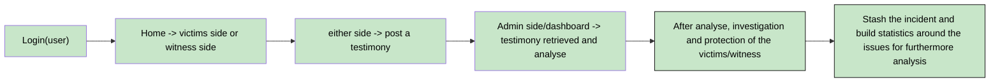

<hi>HAVEN LAB</h1>  

This is a tutored project directed by <placeholder>

  
<h2>Table of Contents</h2>

  <ol>
    <li><a href="#TEAM FORMATION">TEAM FORMATION</a>
    <li><a href="#RESEARCH AND BRAINSTORMING">RESEARCH AND BRAINSTORMING</a></li>
    <li><a href="#MVP CONCEPT">MVP CONCEPT</a></li>
  </ol>

<h2><u>TEAM FORMATION</u></h2>  

    
    
    
  

LANGE Jarod: Project Manager/Fullstack developer 

MERLIERE Gabriel: Fullstack developer  

The formation of this team has been concretise with a meeting around the following project, its challenges and our capabilities at the time.  

(<a href="#readme-top">back to top</a>)

<h2><u>RESEARCH AND BRAINSTORMING</u></h2>  

HavenLab is a platform designed as a mobile application to fight against harassment.
A prototype has been already developped by the firm, it give us a better idea of what they want and also the frontend style.  
  
We try to find similar application or website to see what was already done and briefly study their impact on users.
At the first glance, there are several examples of apps that aims to help the victims and to protect them.

We then discuss about what technology would be the best to use and what type of database management system to put our application on, based on an expectation of number of people that would have a account on it.

For the developpment tools, we use VSCode, git/git hub and Flutter for build an mobile application.  

	

For the database, we have to choose between PostGre and Mongodb, taking in consideration that there will be a maximum charge in term of number of account. Also one of them use SQL, it will be helpful to work the language for the upcoming diploma.

 or

After choosing all the stacks necessary, we then talk about the main objective of the project and how we might translate it into a functional software.
The idea is:  
- a mobile application that provide, to all students, a way to post a report of harrassement and other problematic behavior.
- a AI chatbot integrated for support of the victims, give advice and/or redirect them to the specialised school's staff.
- a way for the staff to follow the issues for a better care of students.

(<a href="#readme-top">back to top</a>)

<h2><u>IDEA EVALUATION</u></h2>  

We did a feasibility study for evaluate the project and build an MVP concept. This has several criteria to define:

- Is the project feasable for a beginner team ( on a scale from 0 to 5 )
- 

Priority color code:  

- 🟥: MVP, Minimum Viable Product. Every part that must be implement to deliver a viable prototype.
- 🟨: Important, part that would have to be implement for a better functionality.
- 🟩: Optionnal, unnecessary or in-discussion part of the project

|Feature|Details|Challenges|Feasibility|Priority|
|:--|:--|:--|:--|:--:|
|Database|Implement the chosen database for the application|Data security must be the higher possible, priority n°1||🟥|
|Login page|A login page with basics redirection. (login, register, password forgotted)|||🟥|
|Home page (user)|A home page with rapid access to functionality. (harassment signalisation, witness harassment, follow up)|||🟥|
|Harassment signalisation (user)|A page with multiple choice (type of harassment, gravity, effect on victim|||🟥|
|Witness signalisation (user)|A page similar to the harassment signalisation, |||🟨|
|Dashboard (admin)|A dashboard for a simple access to a synthesis of all issues and statistics. |||🟥|
|Issues tracker (admin)|A page that regroup all signalisation's follow up. |||🟥|
|Statistic (admin)|A page that shows all statistics with precision and their evolution on time.|||🟨|
|Chatbot integration[optionnal]|An AI chatbot (provided by the firm) to integrate for helping victims to communicate.|||🟩|

<h2><u>DECISION AND REFINEMENT</u></h2>

Following a meeting with the team and the lead project, we decide to use x<placeholder> for the database

(<a href="#readme-top">back to top</a>)

