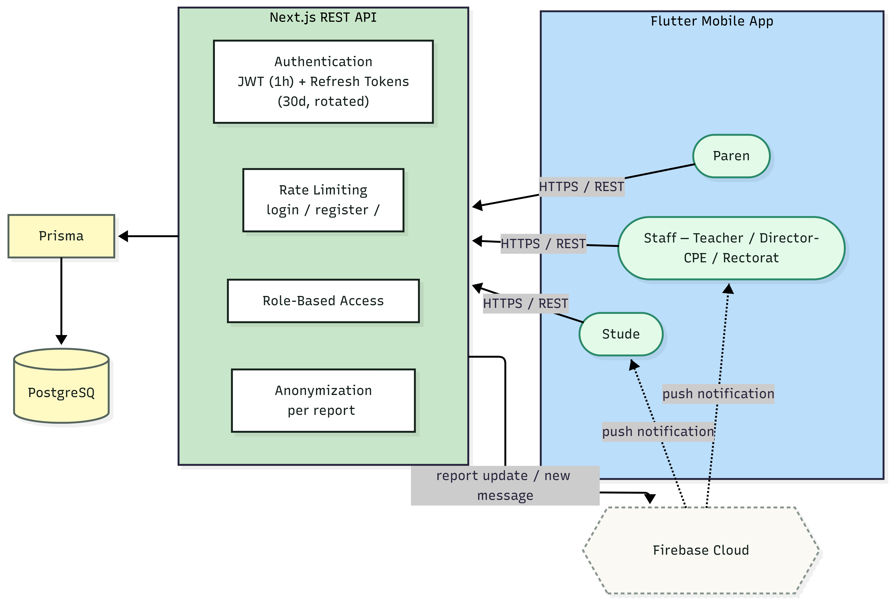

<a id="readme-top"></a>

<h1 align="center">Haven</h1>

<p align="center">
  <strong>A confidential incident-reporting platform for victims and witnesses of bullying in schools.</strong><br/>
  Built by <strong>HavenLab</strong> as a tutored academic project.
</p>

<p align="center">
  <a href="https://flutter.dev/"></a>
  <a href="https://nextjs.org/"></a>
  <a href="https://www.prisma.io/"></a>
  <a href="https://www.postgresql.org/"></a>
  <a href="https://nodejs.org/"></a>
  <a href="https://claude.com/claude-code"></a>
</p>

<p align="center">
  <a href="https://github.com/Alistair31/Portfolio-Project/graphs/contributors"></a>
</p>

---

<details>
  <summary><h2 style="display:inline">Table of Contents</h2></summary>
  <ol>
    <li><a href="#about">About</a></li>
    <li><a href="#features">Features</a></li>
    <li><a href="#tech-stack">Tech Stack</a></li>
    <li><a href="#architecture">Architecture</a></li>
    <li><a href="#project-structure">Project Structure</a></li>
    <li><a href="#getting-started">Getting Started</a></li>
    <li><a href="#testing">Testing</a></li>
    <li><a href="#security">Security</a></li>
    <li><a href="#documentation">Documentation</a></li>
    <li><a href="#team">Team</a></li>
  </ol>
</details>

## About

Harassment in schools is a serious and often under-reported problem — victims frequently stay silent out of fear of retaliation or not being believed. **Haven** gives students a safe, confidential way to report incidents (as a victim or a witness), track the outcome of their report, and reach a trusted adult at their school, while giving staff the tools to manage and act on reports responsibly.

The MVP targets a single pilot school, with role-based access for students, teaching staff, school leadership (CPE/direction), the regional education authority (Rectorat), and parents.

<p align="right">(<a href="#readme-top">back to top</a>)</p>

## Features

**Students**
- Submit a report as a victim or a witness, with an anonymity level of their choosing (name visible → fully anonymous)
- Track submitted reports and their status (pending / in progress / closed), with a tracking code and integrity verification
- Cancel a report within 5 minutes of submission
- Two-way messaging with the staff member handling their report
- Daily mood check-in with a 7-day history
- Emergency/safe-space resources and trusted contacts
- Optional parent linking via a personal parent code

**Staff (Teacher / Direction-CPE / Rectorat)**
- Role- and school-scoped report list with filters (status, type, gravity, tracking code)
- Report detail view with a full follow-up and messaging timeline
- Status updates and escalation to the Rectorat
- Academy statistics dashboard (by status, type, gravity, school) and a timeline chart
- Push notifications on new/updated reports (Firebase Cloud Messaging)

**Parents**
- Read-only view of their linked child's reports, with anonymization still enforced

**Platform**
- JWT authentication with short-lived access tokens and rotating refresh tokens
- Per-user and per-IP rate limiting on sensitive endpoints
- Server-side anonymization enforced regardless of what the client requests
- Report integrity hashing (HMAC-SHA256) so tampering can be detected
- Encrypted on-device storage for session tokens

<p align="right">(<a href="#readme-top">back to top</a>)</p>

## Tech Stack

| Layer | Technology |
| --- | --- |
| Mobile app | [Flutter](https://flutter.dev) |
| Backend API | [Next.js](https://nextjs.org) (App Router) |
| ORM | [Prisma](https://www.prisma.io) |
| Database | [PostgreSQL](https://www.postgresql.org) |
| Push notifications | Firebase Cloud Messaging |

<p align="right">(<a href="#readme-top">back to top</a>)</p>

## Architecture

Haven follows a client-server architecture: the Flutter app talks exclusively to a Next.js REST API, which owns all business logic, authentication, anonymization and role-based access control, and persists data through Prisma into PostgreSQL.

<p align="center">
  
</p>

<p align="right">(<a href="#readme-top">back to top</a>)</p>

## Project Structure

```
Portfolio-Project/
├── haven_app/        # Flutter mobile app (students, staff, parents)
├── haven_backend/     # Next.js REST API, Prisma schema & migrations
├── Images/            # Diagrams (architecture, etc.)
├── API.md             # Internal API contract (routes, payloads, responses)
├── rapport_bugs.md    # Bug tracker & security audit log
├── Stage1_documentation.md          # Team formation, ideation
├── Stage2_Timeline.md               # SMART goals & project planning (Gantt)
├── Stage3_technical_documentation.md # User stories, architecture, API spec, QA plan
└── stage4_development.md            # Agile sprints, MVP delivery, retrospectives
```

<p align="right">(<a href="#readme-top">back to top</a>)</p>

## Getting Started

### Prerequisites

- [Flutter SDK](https://docs.flutter.dev/get-started/install) (Dart ^3.11.5)
- [Node.js](https://nodejs.org) 20+
- A PostgreSQL database (e.g. [Prisma Postgres](https://www.prisma.io/postgres), or any local/hosted instance)
- *(Optional, for push notifications)* A Firebase project with Cloud Messaging enabled

### Backend

```bash
cd haven_backend
npm install
```

Create a `.env` file with:

```bash
DATABASE_URL="postgresql://..."
JWT_SECRET="a long random string"
ADMIN_SECRET="a long random string"          # protects /api/admin/*
REPORT_INTEGRITY_SECRET="a long random string"
SEED_STAFF_PASSWORD="password for seeded staff accounts"

# Optional — enables push notifications
FIREBASE_PROJECT_ID=""
FIREBASE_CLIENT_EMAIL=""
FIREBASE_PRIVATE_KEY=""
```

Then set up the database and start the API:

```bash
npx prisma generate
npx prisma migrate deploy
npx prisma db seed      # optional: creates sample school/staff accounts
npm run dev             # http://localhost:3000
```

### Mobile app

```bash
cd haven_app
flutter pub get
flutter run --dart-define=BASE_URL=http://10.0.2.2:3000/api   # Android emulator
```

`BASE_URL` defaults to the Android emulator loopback address; pass your machine's local IP for a physical device (e.g. `http://192.168.x.x:3000/api`).

<p align="right">(<a href="#readme-top">back to top</a>)</p>

## Testing

```bash
cd haven_app
flutter test
```

The Flutter app has an automated unit/widget test suite (services, models, key pages, role routing). The backend does not yet have an automated test suite — see `stage4_development.md` for planned integration test coverage.

<p align="right">(<a href="#readme-top">back to top</a>)</p>

## Security

Haven has gone through several rounds of internal security review — see [`rapport_bugs.md`](rapport_bugs.md) for the full history, including:

- Anonymity enforced server-side regardless of client-supplied data
- Rate limiting on authentication, admin, and report/messaging endpoints
- Encrypted on-device token storage, no plaintext secrets in `SharedPreferences`
- Constant-time comparisons on secret-bearing checks (admin secret, integrity hash)

If you believe you've found a security issue, please report it privately rather than opening a public issue.

<p align="right">(<a href="#readme-top">back to top</a>)</p>

## Documentation

| Document | Contents |
| --- | --- |
| [`Stage1_documentation.md`](Stage1_documentation.md) | Team formation, research & brainstorming, idea evaluation |
| [`Stage2_Timeline.md`](Stage2_Timeline.md) | SMART objectives and project Gantt planning |
| [`Stage3_technical_documentation.md`](Stage3_technical_documentation.md) | User stories, mockups, architecture, class/sequence diagrams, API spec, SCM/QA plans |
| [`stage4_development.md`](stage4_development.md) | Sprint planning, reviews & retrospectives, MVP delivery status |

<p align="right">(<a href="#readme-top">back to top</a>)</p>

## Team

| Member | Role |
| --- | --- |
| Thomas SPITZ | Founder & President, HavenLab |
| Romain BALLAIS | Chief Technical Officer |
| Jarod LANGE | Project Manager / Frontend Developer |
| Gabriel MERLIERE | Backend Developer |

<p align="right">(<a href="#readme-top">back to top</a>)</p>
