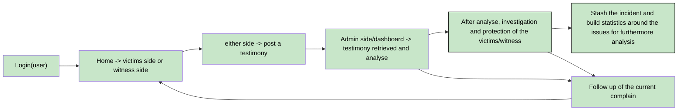

<h1 align="center">HAVEN LAB</h1>

  This is a tutored project directed by Romain BALLAIS and Thomas SPITZ

  
<h2>Table of Contents</h2>

  <ol>
    <li><a href="#team-formation">TEAM FORMATION</a>
    <li><a href="#research-and-brainstorming">RESEARCH AND BRAINSTORMING</a></li>
    <li><a href="#idea-evaluation">IDEA EVALUATION</a></li>
	<li><a href="#decision-and-refinement">DECISION AND REFINEMENT</a></li>
	<li><a href="#user-interaction-diagram">USER INTERACTION DIAGRAM</a></li>
  </ol>

<h2><u>TEAM FORMATION</u></h2>  

    
    
    
  

LANGE Jarod: Project Manager/Fullstack developer 

MERLIERE Gabriel: Fullstack developer  

The formation of this team has been concretise with a meeting around the following project, its challenges and our capabilities at the time.  

(<a href="#readme-top">back to top</a>)

<h2><u>RESEARCH AND BRAINSTORMING</u></h2>  

HavenLab is a platform designed as a mobile application to fight against harassment.
A prototype has been already developped by the firm, it give us a better idea of what they want and also the frontend style.  
  
We try to find similar application or website to see what was already done and briefly study their impact on users.
At the first glance, there are several examples of apps that aims to help the victims and to protect them but few are focused on harassment at school.

We then discuss about what technology would be the best to use and what type of database management system to put our application on, based on an expectation of number of people that would have a account on it.

For the developpment tools, we use VSCode, git/github, NextJs and Flutter for build an mobile application.  

	

For the database, we have to choose between PostGre and Mongodb, taking in consideration that there will be a maximum charge in term of number of account. Also one of them use SQL, it will be helpful to work the language for the upcoming diploma.

 or

After choosing all the stacks necessary, we then talk about the main objective of the project and how we might translate it into a functional software.
The idea is:  
- a mobile application that provide, to all students, a way to post a report of harrassement and other problematic behavior.
- a way for the staff to follow the issues for a better care of students.
- a AI chatbot integrated for support of the victims, give advice and/or redirect them to the specialised school's staff. (potential risk)  

(<a href="#readme-top">back to top</a>)

<h2><u>IDEA EVALUATION</u></h2>  

We did a feasibility study for evaluate the project and build an MVP concept. This has several criteria to define:

- Is the project feasable for a beginner team ( on a scale from 0 to 5 )
- How it will help students to communicate easily and freely about the issues
- What technology we will use for an optimal and scalable solution

Priority color code:  

- 🟥: MVP, Minimum Viable Product. Every part that must be implement to deliver a viable prototype.
- 🟨: Important, part that would have to be implement for a better functionality.
- 🟩: Optionnal, unnecessary or in-discussion part of the project

|Feature|Details|Challenges|Feasibility|Priority|
|:--|:--|:--|:--|:--:|
|Database                        |Implement the chosen database for the application                                                         |Data security must be the higher possible, priority n°1                  |5/5|🟥|
|Login page                      |A login page with basics redirection. (login, register, password forgotted)                               |Depending of the user(privilege level), redirect to a specific home page |1/5|🟥|
|Home page (user)                |A home page with rapid access to functionality. (harassment signalisation, witness harassment, follow up) |Different home page/route to securize                                    |2/5|🟥|
|Harassment signalisation (user) |A page with multiple choice (type of harassment, gravity, effect on victim                                |Anonymisation system (3 levels)                                          |2/5|🟥|
|Witness signalisation (user)    |A page similar to the harassment signalisation,                                                           |Same as Harassment signalisation                                         |2/5|🟨|
|Dashboard (admin)               |A dashboard for a simple access to a synthesis of all issues and statistics.                              |                                                                         |3.5/5|🟥|
|Issue tracker (user)            |A page the user can follow up their signalement.                                                          |                                                                         |3/5|🟥|
|Issues tracker (admin)          |A page that regroup all signalisation's follow up.                                                        |                                                                         |3/5|🟥|
|Statistic (admin)               |A page that shows all statistics with precision and their evolution on time.                              |                                                                         |2/5|🟨|
|Chatbot integration(optionnal)  |An AI chatbot (provided by the firm) to integrate for helping victims to communicate.                     |Potential danger concerning the response of the bot                      |5/5|🟩|  

(<a href="#readme-top">back to top</a>)

<h2><u>DECISION AND REFINEMENT</u></h2>

Following a meeting with the team and the lead project we recieved the statement of work.
After reading and brainstorming about it, we define a MVP to realize:  

- A mobile first application for the protection of students against harassment.  

The project as been launch because of a lack of similar entity specialized for this subject.
The unfortunate students that could be victims or witness of harassment or any other problematic/dangerous behavior will have a platform to post testimony. This will then be analyse by the staff or specialist if needed to ensure that those students will get the necessary help.  

This MVP will be built with the basic feature:
- A highly secured database with Prisma/PostGreSQL.
- A login page that redirect to different page depending on the privilege level of the user logged.
- Home pages: signalment for students, admin dashboard for school staff, statistics for Ministry of National Education.
- A signalment page for students to post testimony of the issues.
- A issues tracker pages: one for students to follow their own testimony, one for admins to follow all of them.  

Within the given deadline: :
- we will deliver a mobile application with basics pages(home, dashboard, signalment, tracker) and a secure database.
- However some features may be too complex or not the highest priority (Chatbot AI).  

The identified risks are:
- The securisation of personal data (high priority).
- The privilege level attribution and management.
- The impact of the chosen color palette  on the user (especially the students) for the frontend.  

(<a href="#readme-top">back to top</a>)

<h2><u>USER INTERACTION DIAGRAM</u></h2>  

This is a basic representation of what happen when an user interact with the application:

- The user login to the application and land on the user home page.
- The user can post a testimony as a victim or witness.
- when posted, it can be followed up by the owner of the testimony or an admin (school staff) at all steps.
- Staff analyze the testimony, investigate and react if necessary.
- Stash the report, build statistics.

(<a href="#readme-top">back to top</a>)

