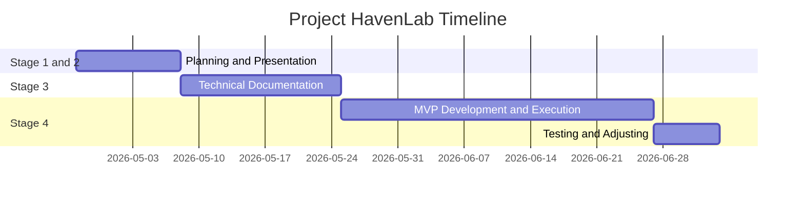

<h1 align=center>Project Planning</h1>

<h2>SMART Method</h2>  

|Criterion|Description|
|:-|:-|
|Specific|The objective is to build a mobile first application to help and protect students against harassment |
|Measurable|At the beggining, only one school will test this application. The next goal is to deploy it to several school |
|Attainable|Some part are already been studied, however the database security and the new technology chosen will be challenging |
|Relevant|Harassment, particulary at school, is a very concerning topic. Issues linked to that behavior are devastating for a lot of students |
|Timely|MVP will be delivered before July 3rd 2026. Detailed planning on the Gantt Diagram below |  

<h2>TIMELINE</h2>

Here is a Gantt Diagram that shows the expected timeline.

