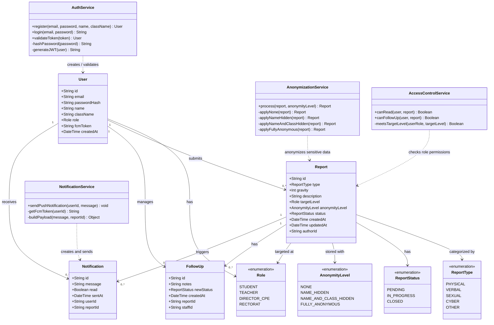
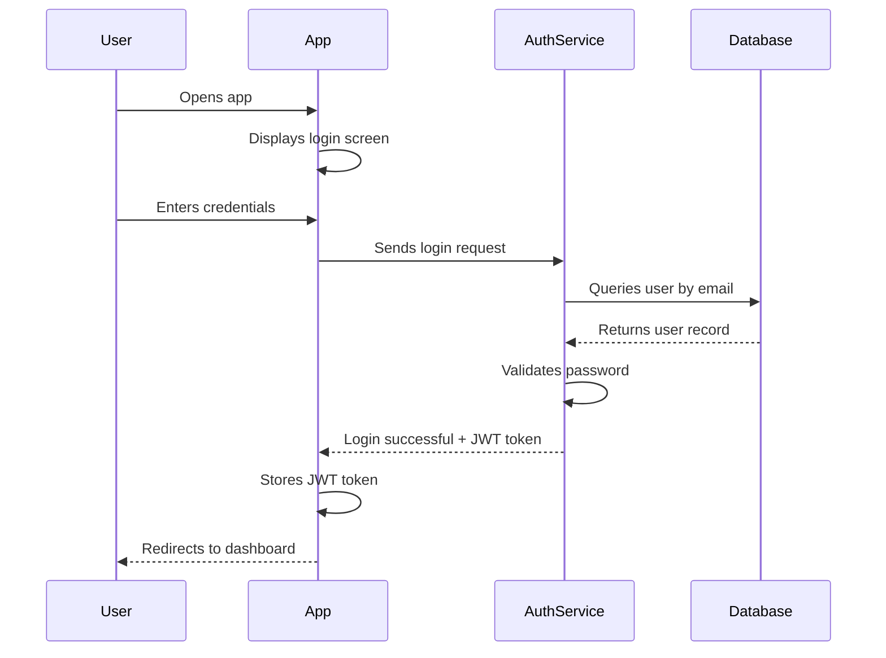
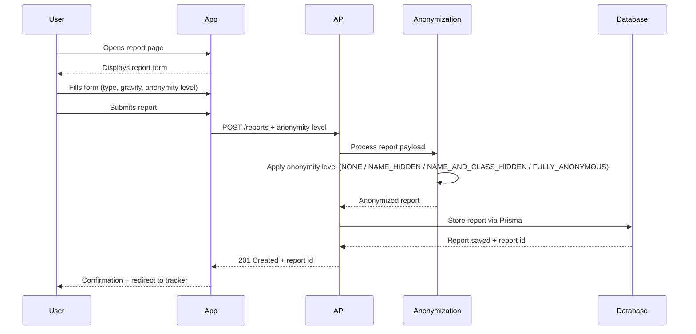
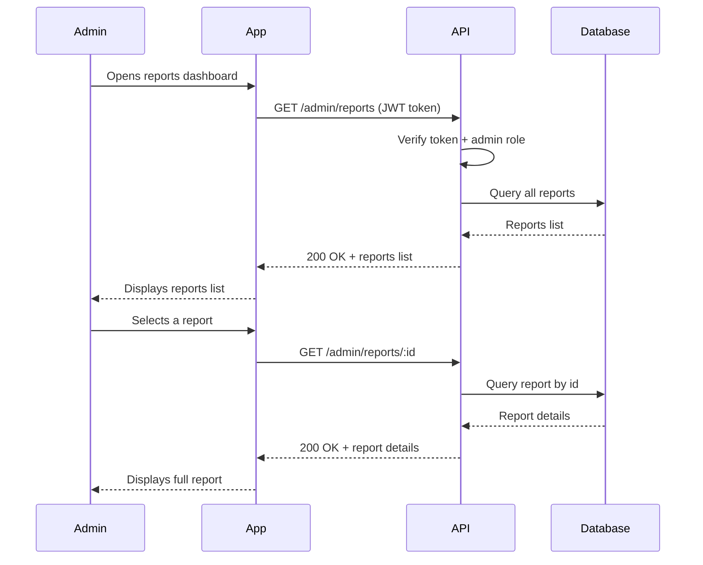
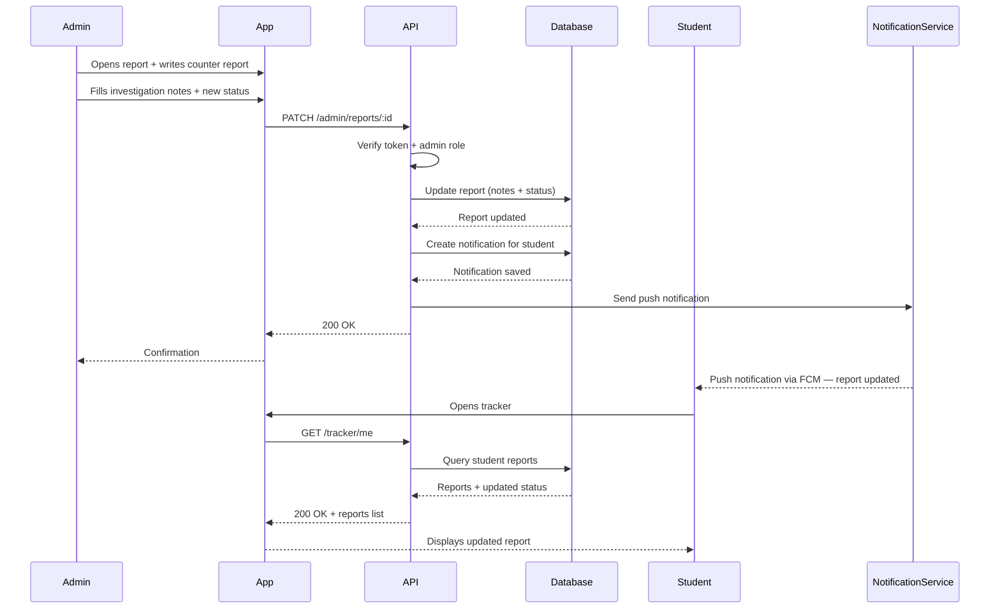

<h1 align=center><strong>Technical Documentation</strong></h1>

  
Table of Contents

  <ul>
    <li><a href="#user-stories">User Stories</a></li>
    <li><a href="#mockups">Mockups</a></li>
	<li><a href="#architecture">Architecture</a></li>
	<li><a href="#class-diagram">Class Diagram</a></li>
	<li><a href="#structure">Structure</a></li>
	<li><a href="#sequence-diagram">Sequence Diagram</a></li>
	<li><a href="#api-specifications">API Specifications</a></li>
	<li><a href="#scm-and-qa-plans">SCM and QA Plans</a></li>
	<li><a href="#technical-justifications">Technical Justifications</a></li>
  </ul>

    

    <b>Flutter</b> • <b>Next.js</b> • <b>Prisma</b> • <b>PostgreSql</b> • <b>Node.js</b>

<h2 id="user-stories">User Stories</h2>

The user stories are there to briefly describe how a user will interact with the application.  
This can be separated in four categories following the MoSCoW method (Must have, Should have, Could have, Won’t have).  
 

<h3><strong>Must have</strong></h3>  

This section represents the mandatory features for the MVP:
<ul>
  <li>As a user, I want to be able to log in or out safely with my account.</li>
  <li>As a user, I want to access to the main feature easily.</li>
  <li>As a user, I want to post a testimony.</li>
  <li>As a user, I want to follow the post I have made.</li>
  <li>As an admin/staff, I want to retrieve testimonies for investigation.</li>
  <li>As an admin/staff, I want to access to a dashboard for data synthesis.</li>
  <li>As an admin/staff, I want to have access to all follow up.</li>
</ul>

<h3><strong>Should have</strong></h3>  

<ul>
  <li>As a user, I want to post a testimony as a witness.</li>
  <li>As an admin/staff, I want to have statistics on harassment.</li>
</ul>

<h3><strong>Could have</strong></h3>  

<ul>
  <li>As a user, I want to have a little box for news or agenda recall</li>
</ul>

<h3><strong>Won’t have</strong></h3>
<ul>
  <li>As a user, I want to use an AI chatbot for helping me.</li>
</ul>

(<a href="#readme-top">back to top</a>)

<h2 id="mockups">Mockups</h2>

Here is a basic render of every page of the future app.

<ul>
  <li>MVP: Login page: A simple login page with the logo on top</li>
  <li>MVP: Register Page: A normal register page with an addition of the class to refer </li>
  <li>MVP: Home Page (User): A home page for students with an access to the report page and the follow up of their own report</li>
  <li>MVP: Home Page (Admin): A home page for staff members. It gives access to the tracker, dashboard and a box on the top where the most recent and most urgent report will be displayed.</li>
  <li>MVP: Report Page (User): A page where students could report an issue. It is composed of preset, the type of issue, the report itself and legal information (if needed).</li>
  <li>MVP: Tracker (Admin): A page where staff members could retrieve any report organised by filter, with a box on top for urgent report.</li>
  <li>MVP: Get Report Page (Admin): A page where staff members have a precise look on a report and can do a follow up.</li>
  <li>MVP: Follow up Page (Admin): A page where staff members have the report on top and can write a follow up, change its status or close it when needed.</li>
  <li>Dashboard Page: Could replace the admin home page for better clarity and less clicks. Regroup every information needed, summarised it and link to the other pages</li>
  <li>Staff/Ministry Chat Page: Could be useful provided it is very secure.</li>
  <li>Statistics Page: Will give precise statistics on the type of reports based on certain characteristics.</li>
</ul>
<iframe
  src="https://www.figma.com/design/QVPO9YaJcaw3oD79mIXDn0/Haven?node-id=38-151&m=dev&t=abJ5ukLg5PqKKDMN-1"
  width="100%"
  height="600"
  style="border: 0; border-radius: 12px;"
  allowfullscreen
  loading="lazy"
  title="Mockup Figma">
</iframe>

> [Open mockups in Figma](https://www.figma.com/design/QVPO9YaJcaw3oD79mIXDn0/Haven?node-id=38-151&m=dev&t=abJ5ukLg5PqKKDMN-1)

(<a href="#readme-top">back to top</a>)

<h2 id="architecture">Architecture</h2>

The application follows a client-server architecture centered around a single mobile application and a dedicated backend API.

- **Flutter** is the main application used by both students and staff members.
  - Students can submit reports and track their status.
  - Staff members can review reports, manage follow-ups, and update report statuses.
- **Next.js** is used exclusively as the backend server and API layer.
- The backend exposes a **REST API** responsible for:
  - authentication,
  - business logic,
  - anonymization,
  - and role-based access control.
- **Prisma** acts as the ORM between the backend and the **PostgreSQL** database.
- **Firebase Cloud Messaging (FCM)** is used to send push notifications when a report status changes.

(<a href="#readme-top">back to top</a>)

<h2 id="class-diagram">Class Diagram</h2>

This diagram represents the relationships between the application's data models and backend services.

> **Note:** `targetLevel` and `anonymityLevel` are independent choices made by the student at submission time. `targetLevel` controls *who handles the report* (access control). `anonymityLevel` controls *what identity data is stored* (anonymization). The `AccessControlService` ensures that only users whose `role` is >= `targetLevel` can read or act on a report.

(<a href="#readme-top">back to top</a>)

<h2 id="structure">Structure</h2>

|Components            |Type|Description                                                                         |
|:---------------------|:---|:-----------------------------------------------------------------------------------|
|Login                 |Page|Users can login if they have credentials                                            |
|Register              |Page|New users can create an account and specify their class                             |
|Home (User)           |Page|For students logged, access to features and follow up status (if any)               |
|Home (Admin)          |Page|For staff members logged, access to specific features and last report(or urgent one)|
|Report (User)         |Page|Students can post a report on incident they have been a victim or a witness         |
|Counter report (Admin)|Page|Staff members can post a follow up of the incident                                  |
|Issues tracker (User) |Page|Complete follow up of their own report                                              |
|Tracker (Admin)       |Page|Staff members can browse all reports, filter by status/type and spot urgent ones    |
|Dashboard             |Page|Summarises key data for staff members and links to other admin pages                |
|Statistics            |Page|Displays statistics on report types and characteristics                             |

(<a href="#readme-top">back to top</a>)

<h2 id="sequence-diagram">Sequence Diagram</h2>

For the users login:

For posting a report:

For an admin to get a report:

For an admin to post a counter report after investigation:

(<a href="#readme-top">back to top</a>)

<h2 id="api-specifications">API Specifications</h2>

### External APIs Used

| API                            | Purpose                                                       | Why chosen                                            |
|--------------------------------|---------------------------------------------------------------|-------------------------------------------------------|
| Firebase Cloud Messaging (FCM) | Push notifications to students when their report status changes | Free, cross-platform, easy to integrate with Flutter |
| (Optional future) SendGrid     | Email notifications for report updates                        | Useful to reach users who disabled push notifications |

---

### Internal API Endpoints (MVP)

#### Authentication

| Method | Endpoint | Description | Input (JSON) | Output (JSON) |
|--------|----------|-------------|--------------|---------------|
| **POST** | `/auth/register` | Register a new user | `{ "email": "string", "password": "string", "name": "string", "class": "string" }` | `{ "id": "uuid", "email": "string", "name": "string" }` |
| **POST** | `/auth/login` | Log in and receive JWT | `{ "email": "string", "password": "string" }` | `{ "accessToken": "jwt_token" }` |
| **POST** | `/auth/logout` | Invalidate session | Header: `Authorization: Bearer <token>` | `{ "message": "Logged out" }` |
| **POST** | `/auth/refresh` | Refresh JWT token | `{ "refreshToken": "string" }` | `{ "accessToken": "jwt_token" }` |

---

#### Reports (User)

| Method | Endpoint | Description | Input | Output |
|--------|----------|-------------|-------|--------|
| **POST** | `/reports` | Submit a new incident report | `{ "type": "PHYSICAL\|VERBAL\|SEXUAL\|CYBER\|OTHER", "gravity": 1-3, "description": "string", "targetLevel": "TEACHER\|DIRECTOR_CPE\|RECTORAT", "anonymityLevel": "NONE\|NAME_HIDDEN\|NAME_AND_CLASS_HIDDEN\|FULLY_ANONYMOUS" }` | `{ "id": "uuid", "status": "PENDING", "createdAt": "datetime" }` |
| **GET** | `/tracker/me` | Get the logged-in student's own reports | Header: `Authorization: Bearer <token>` | `[ { "id": "uuid", "type": "string", "status": "string", "updatedAt": "datetime" } ]` |
| **GET** | `/notifications/me` | Get the logged-in student's notifications | Header: `Authorization: Bearer <token>` | `[ { "id": "uuid", "message": "string", "read": "boolean", "sentAt": "datetime" } ]` |

---

#### Reports (Admin)

| Method | Endpoint | Description | Input | Output |
|--------|----------|-------------|-------|--------|
| **GET** | `/admin/reports` | Get all reports (filterable) | JWT (admin role) + Query: `?status=PENDING&type=VERBAL` | `[ { "id": "uuid", "type": "string", "gravity": 1-3, "status": "string", "createdAt": "datetime" } ]` |
| **GET** | `/admin/reports/:id` | Get full details of one report | Path param: `id` | `{ "id": "uuid", "type": "string", "description": "string", "gravity": 1-3, "status": "string", "followUp": "string\|null" }` |
| **PATCH** | `/admin/reports/:id` | Add follow-up notes and update status | `{ "notes": "string", "status": "in_progress\|closed" }` | `{ "id": "uuid", "status": "string", "updatedAt": "datetime" }` |

---

> **Note:** All endpoints return errors in the format `{ "error": "message" }`. Protected routes require a valid JWT in the `Authorization: Bearer <token>` header. Admin routes additionally verify the `admin` role encoded in the token.

(<a href="#readme-top">back to top</a>)

<h2 id="scm-and-qa-plans">SCM and QA Plans</h2>

### Source Control Management (SCM)

We use **Git** with **GitHub** for version control and collaboration.

**Branching strategy:**

- `main` → always contains stable, production-ready code. Only merged into when `dev` is clean and fully functional.
- `dev` → integration branch. Personal branches are merged here first for testing before going to `main`.
- `Gabriel` / `Jarod` → personal development branches. Each team member works on their own branch.

**Workflow:**

1. Work on your personal branch (`Gabriel` or `Jarod`).
2. Commit regularly with clear messages (e.g. `feat: add report submission endpoint`).
3. Open a Pull Request from personal branch → `dev`.
4. Code review by the other team member.
5. Once `dev` is stable and all features work together → merge `dev` → `main`.

---

### QA (Quality Assurance)

**Testing strategy:**

| Type | Tool | What it covers |
|------|------|----------------|
| Unit tests | **Jest** | Individual backend service functions (e.g. anonymization logic, token validation) |
| API tests | **Jest + Supertest** | HTTP endpoints: auth, report submission, admin routes |
| Mobile UI tests | **Flutter widget tests** | Key screens: login form, report form, tracker view |
| Manual tests | **Postman / Insomnia** | Full user flows: login → report → admin follow-up |

**Code quality:**

- **ESLint + Prettier** on the Node.js side to enforce consistent formatting.
- **Dart analyzer** on the Flutter side for static analysis.
- Pull Request reviews before any merge into `main`.

---

### Deployment Pipeline

| Environment | Purpose | Details |
|-------------|---------|---------|
| **Development** | Local machines | Each developer runs the stack locally with a local PostgreSQL instance |
| **Staging** (optional) | Pre-production testing | Mirror of production with test data; used to validate full flows before release |
| **Production** (future) | Live school deployment | Real server, real database, notifications enabled |

**CI steps (planned):**
1. Push to a branch → GitHub Actions triggers automatically.
2. Run `jest` test suite.
3. Run linter checks.
4. If all pass → branch is safe to merge into `main`.

(<a href="#readme-top">back to top</a>)

<h2 id="technical-justifications">Technical Justifications</h2>

The following table explains why each technology in our stack was chosen over common alternatives, specifically in the context of a school harassment reporting application.

| Technology | Role | Why we chose it | Alternative considered |
|------------|------|-----------------|------------------------|
| **Flutter** | Main application (students and staff) | Single codebase for Android, iOS, and other supported platforms. This reduces development time while providing a consistent UI and high performance across devices. | React Native — rejected because Flutter offers better rendering performance and more consistent cross-platform design. |
| **Next.js** | Backend API server | Used as the backend layer through API routes and server-side features. Provides a structured architecture, easy API development, and seamless integration with the JavaScript/TypeScript ecosystem. | Express.js — rejected because Next.js provides a more integrated full-stack architecture with built-in routing and server capabilities. |
| **Node.js** | Runtime environment | Handles asynchronous operations efficiently, which is useful for concurrent report submissions, authentication, and notifications. Using JavaScript/TypeScript across the stack simplifies development. | Django (Python) — considered but rejected to keep a unified JavaScript/TypeScript stack. |
| **Prisma** | ORM (database access) | Type-safe database queries reduce runtime errors and improve maintainability. Prisma also simplifies schema migrations and database management. | Sequelize — rejected because Prisma offers better TypeScript support and a cleaner developer experience. |
| **PostgreSQL** | Database | Relational data structures fit the application's needs well: users, reports, follow-ups, and notifications all have strong relationships. ACID compliance ensures reliable and secure data handling. | MongoDB — rejected because the project relies heavily on relational and structured data. |
| **Firebase Cloud Messaging (FCM)** | Push notifications | Enables real-time notifications to inform users when a report status changes or receives a follow-up. Reliable cross-platform notification delivery. | OneSignal — rejected because FCM integrates more naturally with Firebase services and Flutter. |

**Key design decisions:**

- **Anonymity levels** (`NONE / NAME_HIDDEN / NAME_AND_CLASS_HIDDEN / FULLY_ANONYMOUS`) are processed server-side before storage, not client-side, to prevent users from bypassing anonymization by modifying the request.
- **JWT** is used for authentication to keep the backend stateless and scalable, with the admin role encoded directly in the token payload.
- **A single Flutter app** handles both student and staff interfaces, with role-based access control enforcing a clear separation of features and reducing the attack surface of the admin interface.

(<a href="#readme-top">back to top</a>)

